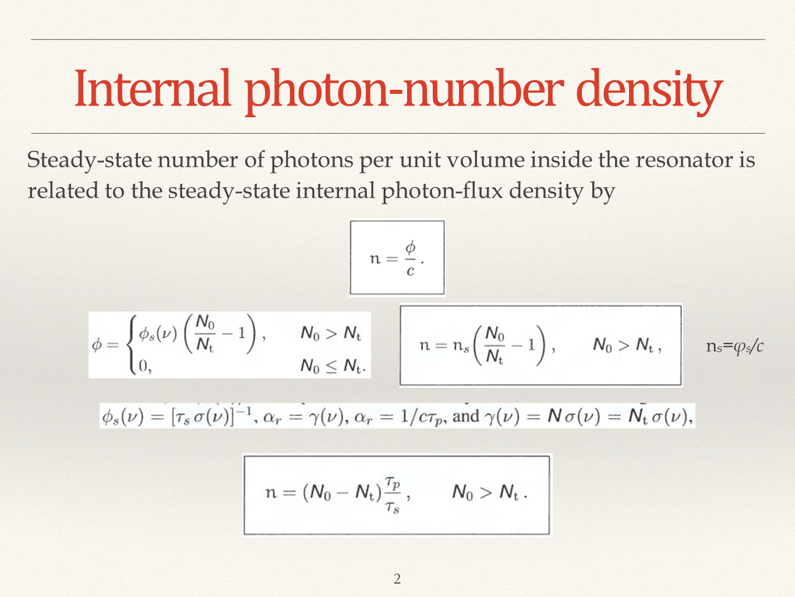
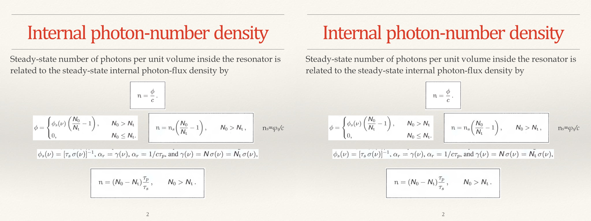
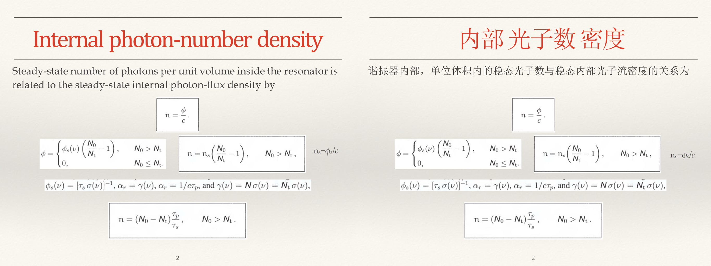

# PPT Pair Generator
 
 生成对照式的幻灯片。
 
 Make every slide a pair.

## 许可 License

GNU AFFERO GENERAL PUBLIC LICENSE - Version 3

This software is a [Free/Libre Software](https://www.gnu.org/philosophy/free-sw.en.html).

本软件 是 [自由软件](https://www.gnu.org/philosophy/free-sw.html)。

## 作用  Effect

让每一张幻灯片都变成左右对照的形式。如下面的`图0`到`图1`.

Turn each slide into a left-right comparison format as shown in `Fig. 0` to `1` below.

`Fig. 0` One Slide of the Original .PPTX

`Fig. 1` One Slide of the Processed .PPTX

## 目的  Purpose

本人想翻译老师的课件，就心血来潮做了这么一个工具，处理后的文件方便对照原文和翻译后的内容。如下图。

I’d like to translate the teacher's courseware, so I came up with a tool that made it easy to compare the translated content with the original text in the processed file. As shown in the figure below.

---

***注意：该软件没有翻译功能。***

***Notice: This software does not have translation functionality.***